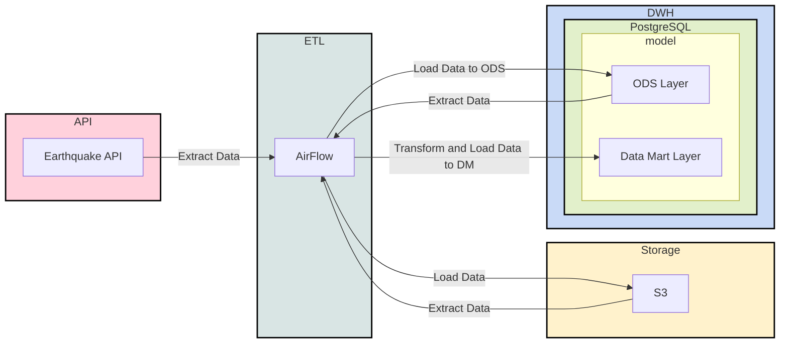

# ELT Earthquake Pet-Project

## Создание виртуального окружения

```bash
python3.12 -m venv venv && \
source venv/bin/activate && \
pip install --upgrade pip && \
pip install -r requirements.txt
```

## Разворачивание инфраструктуры

```bash
docker-compose up -d
```

## Data Governance


### 1. Data Architecture

Lakehouse



### 2. Data Modeling & Design

Не применяется звезда, снежинка или другое, потому что в этом нет необходимости. Данных немного. Состояние измениться не
может, поэтому создаём модель по типу "_AS IS_".

### 3. Data Storage & Operations

#### Storage

Cold, Warm Storage – S3
Hot Storage – PostgreSQL

#### Compute/Operations

DuckDB – Data Lake
PostgreSQL – DM layer

### 4. Data Security

Безопасность настраивается на уровне пользователей в S3 и ролевой модели в PostgreSQL. В Airflow задаётся безопасность
через роли.

Здесь может быть использован LDAP

### 5. Data Integration & Interoperability (Интеграция данных и совместимость)

В данном случае не занимаюсь этим пунктом, потому что для демонстрации и текущей реализации достаточно, но для
"правильной" работы необходимо ods слой "_приводить_" к нужным типам.

К примеру, сейчас:

```sql
...
time varchar
...
```

А нужно:

```sql
...
time timestamp
...
```

### 6. Documents & Content

Комментарии, описание на внутренних ресурсах и прочее

### 7. Reference & Master Data

В данном случае у нас данные, которые находятся в Data Lake S3, являются "_золотыми_". Мы их взяли из источника "_как есть_"
и не модифицируем, тем самым вероятность их потерять в нашем пайплайне равно 0%. Но это не говорит, что изменение данных
невозможно/запрещено. Разрешено в других "_слоях_", на уровне dwh или в своих реализациях.

### 8. Data Warehousing & Business Intelligence

Как было сказано выше "_горячее_" хранение у нас в PostgreSQL.

Из общих рекомендаций по данному пункту:

1) Задавать "_жизнь_" для витрин. Потому что сейчас бизнесу нужна витрина `N`, а через месяц нет. И чтобы она не крутилась
   просто так необходимо проводить "уборки".
2) Определить роли для отчётов и допустимых зон. К примеру C-уровень должен видеть Все отчёты. А уровень курьеров не
   должен видеть витрины по опционам и выручке компании
3) Сформировать правила формирования витрин
    1) Один показатель – одна витрина
    2) Один показатель – одна вью/мат.вью
    3) Широкая витрина
    4) Одна таблица, которая содержит все показатели и её вид примерно такой: дата-день, тип показателя, значение
4) Мониторинг активности и нагрузка
5) Автоматическое обновление. Исключить "_ручной_" труд

### 9. Meta-data

Сейчас мета-данных нет, но их можно задать к примеру через комментарии к столбцам в DWH.

Вот к примеру описание всех колонок – [Описание полей из API](https://earthquake.usgs.gov/data/comcat/index.php)

Для уровня Data Lake явно должны быть свои инструменты для формирования мета-данных.

Тут необходимо искать удобный для вашей команды дата-каталог: OpenMetaData, DataHub и прочее.

### 10. Data Quality

Дата кволити сейчас нет. Потому что опять же долго реализуется и это большая тема.

Но из основного:

1) Нужно смотреть "_долетели_" ли данные (ACID).
2) Смотреть SLA доставки данных
3) Определить важные дашборды. И повешать разные алерты на них.
4) Стараться при возможности смотреть на "источник". Условно Если у на источнике 1000 строк, а у нас в Data Lake/DWH 999
   строк мы должны узнать об этом сразу, а не через месяц.
5) Нужен процесс, который позволит исправлять такие ошибки
6) Если витрина Очень важная, то проводить свои тесты перед попаданием их на прод. Смотреть на дельту между значениями,
   смотреть на среднее значение и прочее. Критерии "качества" необходимо выяснять у бизнеса.

